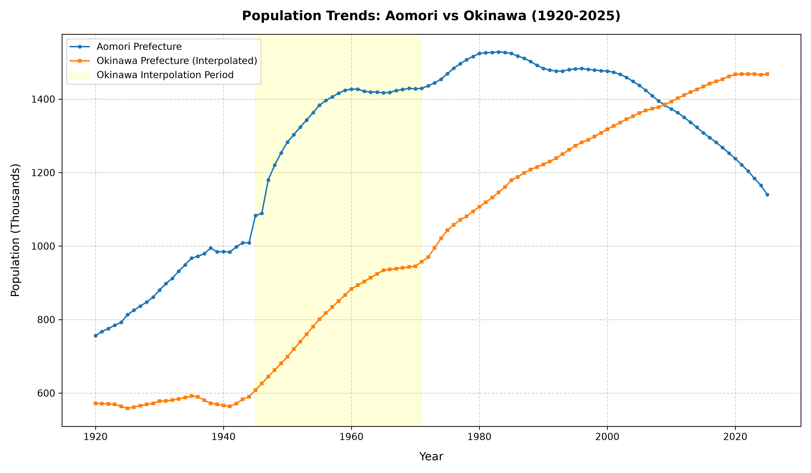

# 人口推計・国勢調査データ統合・補完および分析結果 報告書

総務省の都道府県別人口推計Excelデータと、令和7年（2025年）国勢調査速報データを統合し、整理されたCSVファイルを作成しました。さらに、沖縄県の米国施政権下における欠測期間（1945年〜1971年）の人口データを補完し、そのデータに基づく人口動態分析レポート（PowerPoint）を作成しました。

## 作成・修正したファイル

1. **分析レポート (PowerPoint)**: [prefecture_population_analysis.pptx](./prefecture_population_analysis.pptx)
   * 1920年〜2025年の105年間のデータを用いた、5つのアプローチによる人口動態分析報告プレゼンテーション資料（全10枚）。
2. **統合データ（初期版・欠損あり）**: [prefecture_population.csv](./prefecture_population.csv)
   * 1945年〜1971年の沖縄県は `NaN`（欠損）です。
3. **補完済データ（沖縄補完版）**: [prefecture_population_okinawa_interpolated.csv](./prefecture_population_okinawa_interpolated.csv)
   * 欠測期間の沖縄県の人口を線形補間によって補完したデータ。
4. **分析・レポート自動生成スクリプト**: [generate_analysis_report.py](./generate_analysis_report.py)
   * データの読み込み、各種分析（ピーク年、クラスタリング、都市圏シェア、減少速度）、グラフ作成、および `python-pptx` を用いたPowerPointスライド自動生成を行うスクリプト。

---

## PowerPointレポートの構成（全10スライド）

作成された [prefecture_population_analysis.pptx](./prefecture_population_analysis.pptx) は以下の構成となっています。各分析結果を可視化したグラフ画像が埋め込まれています。

* **Slide 1**: タイトルスライド
* **Slide 2**: 分析の目的・概要
* **Slide 3**: **分析① 都道府県別の人口ピーク年** (グラフ埋め込み)
  * 多くの地方が昭和30年代（1950年代）にすでにピークを迎えていた歴史的事実を可視化。
* **Slide 4**: **分析② 人口推移パターンのクラスタリング分類** (グラフ埋め込み)
  * 1920年を100として標準化し、K-Means法で4つの成長・減少パターンに分類。
* **Slide 5**: **各グループの特徴と該当都道府県**
  * クラスター別の該当県（東京などの都市部、東北などの減少県、横ばいの地方都市など）の一覧。
* **Slide 6**: **分析③ 都市圏への一極集中シェアの推移** (グラフ埋め込み)
  * 関西圏のシェア低下と、東京圏（一都三県で30%突破）への極端な一極集中プロセスの可視化。
* **Slide 7**: **分析④ 人口減少速度と「加速度」** (グラフ埋め込み)
  * 2020年〜2025年の減少率（秋田県、青森県、岩手県がワースト）と減少スピードの加速を説明。
* **Slide 8**: **分析⑤ 特異地域（沖縄県）の要因分析**
  * 全国減少の中で増加し続ける沖縄県の出生率や復帰後の社会要因を考察。
* **Slide 9**: **地域政策および将来への提言**
  * 地域タイプ別の少子化対策、インフラ集約（スマート・シュリンク）の重要性を提言。
* **Slide 10**: **全体のまとめ**

---

## グラフ検証：青森県 vs 沖縄県（人口推移）

青森県と、補完された沖縄県の人口推移を比較したグラフです。（黄色の背景部分は沖縄県の補完実施区間を示しています）

